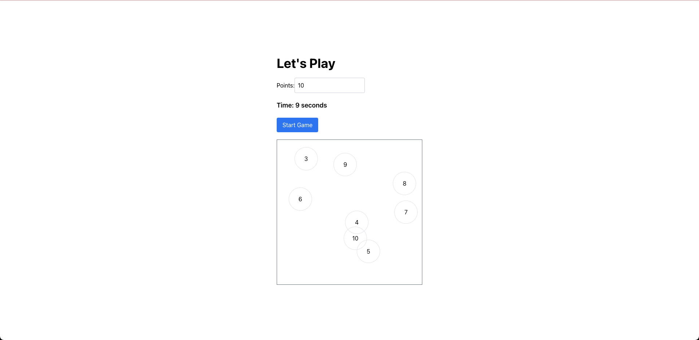

# Number Sequence Game

Welcome to the Number Sequence Game! This is a simple game where players click on numbers in ascending order. The game includes a timer and provides feedback when all numbers are clicked in the correct order.



## Features

- Input to specify the number of elements in the game.
- Randomly positioned numbers within the game area.
- Timer to track the duration of the game.
- Feedback when all numbers are clicked in the correct order.

## Getting Started

To run the project locally, follow these steps:

### Prerequisites

- Node.js and npm (or Yarn) installed on your machine.

### Installation

1. **Clone the Repository**

   ```bash
   git clone https://github.com/baophuchuynhngoc/number-clicker-game.git
2. **Navigate to the Project Directory**
    ```bash
    cd number-sequence-game
3. **Install Dependencies**
    ```bash
    npm install

    Or if using Yarn:
    ```bash
    yarn install
4. **Start the Development Server**
     ```bash
    npm start

    Or if using Yarn:
    ```bash
    yarn start
    This will open the game in your default web browser.
## How to play

1. **Enter the Number of Elements**

    In the input field, enter the number of elements you want in the game and click the "Start Game" button.


2. **Click on the Numbers**

    Numbers will appear randomly within the game area. Click on the numbers in ascending order, starting from 1.


3. **Complete the Game**

    When all numbers are clicked in the correct order, the game will display "ALL CLEAR" and the timer will stop.
